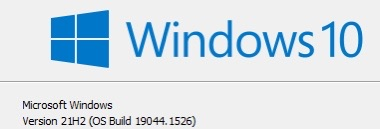
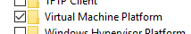
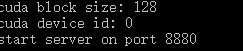
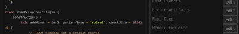

## df-explorer for Dark Forest Setup on Windows

[df-explorer]( https://github.com/guild-w/df-explorer) is a GPU explorer for [Dark Forest](https://zkga.me/). It is based on Linux system, this guide shows how to set it up on Windows using WSL(Windows Subsystem Linux).

This guide is by @waffle from #[dfdao]([discord.gg/aaHada53mQ](https://t.co/XDdUlzNW86)) community.

1. Update Windows and make sure Windows Version is 21H2. Run `winver` in cmd shell and you should get. You might need a manual update from control panel or [Microsoft](https://www.microsoft.com/en-us/software-download/windows10). 

   

2. Make sure Nvidia driver is [up to date](https://www.nvidia.com/download/index.aspx).

3. Install WSL:

   1. Search in Control Panel for "turn windows features on or off", enable the following: *Windows Subsystem for Linux* and *Virtual Machine Platform*

      

   2. Run cmd shell as administrator, `wsl --install -d ubuntu`

   3. Once ubuntu installs, `wsl --set-default-version 2` and `wsl --update`, then `wsl` to get into ubuntu.

4. In Ubuntu shell:

   1. `sudo apt update` && `sudo apt full-upgrade`

   2. Then these https://developer.nvidia.com/cuda-downloads?target_os=Linux&target_arch=x86_64&Distribution=WSL-Ubuntu&target_version=2.0&target_type=deb_network 

      `wget https://developer.download.nvidia.com/compute/cuda/repos/wsl-ubuntu/x86_64/cuda-wsl-ubuntu.pin`

      `sudo mv cuda-wsl-ubuntu.pin /etc/apt/preferences.d/cuda-repository-pin-600`

      `sudo apt-key adv --fetch-keys https://developer.download.nvidia.com/compute/cuda/repos/wsl-ubuntu/x86_64/7fa2af80.pub`

      `sudo add-apt-repository "deb https://developer.download.nvidia.com/compute/cuda/repos/wsl-ubuntu/x86_64/ /"`

      `sudo apt-get update`

      `sudo apt-get -y install cuda`

   3. `sudo apt install cmake` and `sudo apt-get install libssl-dev`

   4. Follow the guide in [df-explorer github](https://github.com/guild-w/df-explorer)

      1. It might end up saying `No CMAKE_CUDA_COMPILER could be found`. Edit *CMakeCache.txt* using `nano CMakeCache.txt` (or any other text editor) and find the part where it says `CMAKE_CUDA_COMPILER:FILEPATH=CMAKE_CUDA_COMPILER-NOTFOUND` and change it to `CMAKE_CUDA_COMPILER:FILEPATH=/usr/local/cuda-11.6/bin/nvcc` or wherever else you install *Cuda*.

      2. You should see something like this after the server started.

         

   5. If everything works, then you can go into the game and run the Remote Explorer plugin, put in http://localhost:8880/explore

      

      If you have a good GPU, you can increase the remote explorer hash chunk by editing the Remote Explorer plugin script:

      

